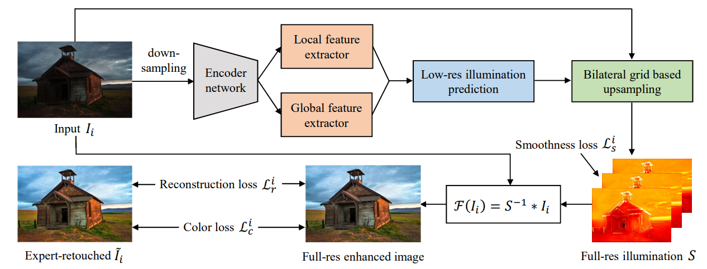
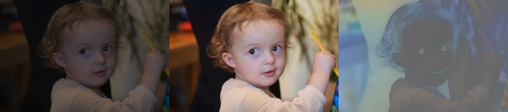
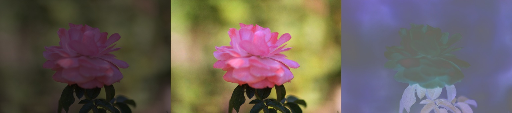
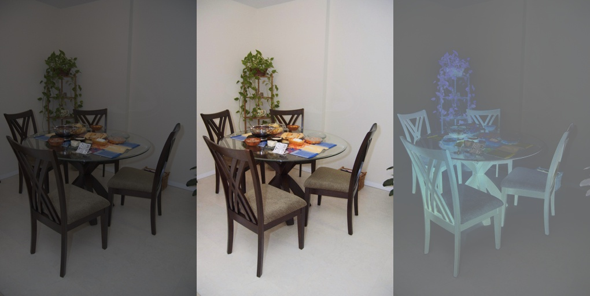
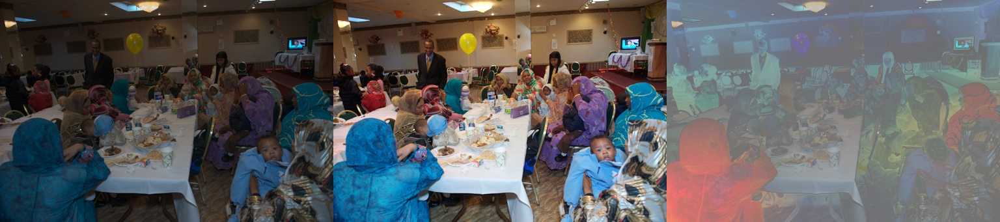

# DeepUPE_pytorch
**unofficial** inplementation of paper 《Underexposed Photo Enhancement using Deep Illumination Estimation》(2019 CVPR)



非官方实现，个人做实验需要，不保证和论文以及官方代码一致。

先来说说官方对于论文的实现：

1. 首先第一点，官方实现 [DeepUPE](https://github.com/dvlab-research/DeepUPE) ，整体架构很多都 “来自” google 的 [hdrnet](https://github.com/google/hdrnet) ，网络结构那块，除了 `_coefficients` 部分加深了网络结构以外，其他的部分几乎一模一样。思路就是，用 **HDRNet** 求光照估计图 S，然后用原图 I / S 得到反射图 R，**好，模型结束**。
2. 第二点，损失函数，可能是唯一勉强可以说有贡献的地方？一个重构损失 MSE，谁都有；一个颜色损失，简单，暂且不提；一个针对光照估计图 S 的最小二乘平滑损失项，来约束光照图的平滑，个人理解是使得增强结果尽量平滑，尽量少出现块效应、色彩畸变等等问题。我具体实验过了，加上这两个损失，收敛明显更快了，而且第一个 epoch 可视化的图片也都正常；如果不加这两个损失，第一个 epoch 可视化的图片会有一些块效应。

所以，这篇 CVPR2019 的论文贡献到底在哪儿？

只是个人实验复现，需要训练它，毕竟还是很多论文拿这个 DeepUPE 来做对比算法的。

说下代码，官方代码 **抄袭** 的 tensorflow 1.1.0 实在是丑，晦涩难懂，不好改，及时联系拿到了 `train.py` 也一路问题......因此，我直接按照官方拼凑的思路，**抄袭** 这位老哥的 [hdrnet-pytorch](https://github.com/creotiv/hdrnet-pytorch)  的 HDRNet ，用来求解光照估计图，**然后我只是写了下那几个损失和训练过程**，代码都是用 pytorch 实现的，没有太大的平台限制，linux 跟 windows 都可以跑，不用 make, cmake 等等。

最终在  [MIT-Adobe FiveK](https://data.csail.mit.edu/graphics/fivek/)  数据集上，512px 分辨率，4500 对图像做训练 train ，剩下 500 对做验证 valid，PSNR 达到了 **23.547db**，SSIM 达到了 **0.8578**。跟官方代码，在同样数据上得到的结果差不多，psnr 在 23.5db 左右，至于论文里写的指标 30db......纯属扯淡。 


## 1. Environment

1. Python 3.7.9
2. Pytorch 1.1.0
3. Cuda 9.0.176
4. opencv-python 4.4.0.46
5. scikit-image 0.15.0
6. ......

安装所有工具包

```shell
conda create -n cuda_9.0_python3.7 python=3.7
conda activate cuda_9.0_python3.7 
conda install cudatoolkit=9.0 cudnn=7.6.5
pip install -r requirements.txt 
```

**环境建议用 torch==1.1.0！！！用其它的 torch 1.7.1 效果会更差，原因暂且不明，后面会有效果演示**


## 2. Inference

```shell
python inference.py 
```

具体参数在 `inference.py` 的第 30 - 50 行之间修改，如下：

```python
# 一个文件夹, 里边放要测试的图片, images folder for inference
opt.images_dir = "./sample_imgs"
# 一个文件夹, 放输出的增强图像结果, images folder for save results
opt.result_dir = './sample_results'
# 训练好的网络权重路径
opt.checkpoints_file = './checkpoints/simple_batch_16/epoch_48_psnr_23.677.pth'
```

### 2.1 samples

从左到右分别是：原图 I，增强结果 R， 光照估计图 S

人 people



物 object



室内 Indoors



室外 Outdoors


夜景 Night


背光  Backlit


复杂场景  Complex 




### 2.2 details

细节展示, 用高分辨率的图像


如上，处理高分辨率图像（分辨率2000x3008，以上图举例），求光照图时，先求得 256x256 大小的系数，然后联合双边网格上采样到 2000x3008。得到的结果显而易见，整体的曝光还是恢复地不错。而且观察细节部分，没有明显地模糊或者人工痕迹，还是能接受的。


## 3. Datasets

使用的是 [MIT-Adobe FiveK](https://data.csail.mit.edu/graphics/fivek/) 数据集的 **ExpertC** 图像对。本实验采用的 512px 分辨率（长宽最大 512，按比例下采样）的图像，下载链接如下：

1. [one drive](https://bupteducn-my.sharepoint.com/:u:/g/personal/fluence_dyf_bupt_edu_cn/EbbaJoJVSG9Guh5TWMLCXw8B0DkHPMwCGZ9QQeUtm6pwSA?e=FovmfI)

也可以使用其他数据集，低光照的数据集，比如 LOL 等。


## 4. Train

```shell
python train.py
```

可调整的参数很多，在 `train.py` 的 30 - 130 行修改，都很好理解，就不一一解释了

```python
# 参数
opt = lambda: None
# hdrnet 参数
opt.luma_bins = 8
opt.channel_multiplier = 1
......
# 训练参数
opt.use_cuda = True
opt.optimizer = torch.optim.Adam
......
# 实验参数
opt.exp_name = "simple_batch_16"
opt.dataset_ratios = [0.9, 0.1]
opt.dataset_dir = '/home/cgy/Chang/image_enhancement/datasets/fiveK'
......
# 可视化参数
opt.visualize_size = 16
opt.visualize_batch = 100
opt.visualize_dir = os.path.join(opt.checkpoints_dir, './train_phase') 
......
```

训练结束后，训练配置文件都会保存到 checkpoints_dir 下的 `option.pkl` 中。

一般训练 30 个 epoch 就收敛了。当然，这里边没有什么高超的提分技巧，一个 baseline。


## 5. Validation

```shell
python test.py
```

如果是使用 fivek 数据集验证，在 `test.py` 的 40 - 50 行中修改参数，主要几个输入参数如下

```python
# 配置文件, 这里保存了验证集的列表
opt.config_file = "./checkpoints/simple_batch_16/options.pkl"
# fiveK 数据集, 目录下两个子目录 input、expertC_gt, 分别存放低光照图和高质量正常曝光图
opt.dataset_dir = "/home/cgy/Chang/image_enhancement/datasets/fiveK"
# 训练好的网络权重路径
opt.checkpoints_file = './checkpoints/simple_batch_16/epoch_48_psnr_23.677.pth'
```

还要注意一点，训练过程中使用的验证数据都是 resize 成 512x512 的，因为要 batch 训练，**但这里的验证数据都是保持长宽比例的低分辨率图（类似 341x512、314x512）**，同时验证图像是没参与过训练的，这点要保证。

如果要换其他数据集，例如 LOL 数据集，要注意换数据集路径建议安排成：input（低光照图集合）、expertC_gt（正常光照图集合），要一一对应，包括了训练和验证的数据。具体划分可参考 `pipeline.py` 中的 `get_images() `。


## 6. Reference

**paper**

1. Underexposed Photo Enhancement using Deep Illumination Estimation
2. Deep Bilateral Learning for Real-Time Image Enhancement
3. Learning Photographic Global Tonal Adjustment with a Database of Input / Output Image Pairs

**Github**

1. https://github.com/google/hdrnet
2. https://github.com/creotiv/hdrnet-pytorch
3. https://github.com/dvlab-research/DeepUPE

**MIT-Adobe FiveK**

```txt
@inproceedings{fivek,
	author = "Vladimir Bychkovsky and Sylvain Paris and Eric Chan and Fr{\'e}do Durand",
	title = "Learning Photographic Global Tonal Adjustment with a Database of Input / Output Image Pairs",
	booktitle = "The Twenty-Fourth IEEE Conference on Computer Vision and Pattern Recognition",
	year = "2011"
}
```

